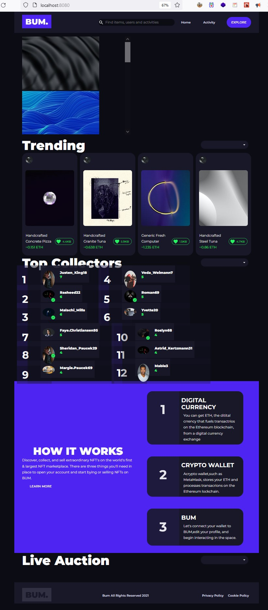
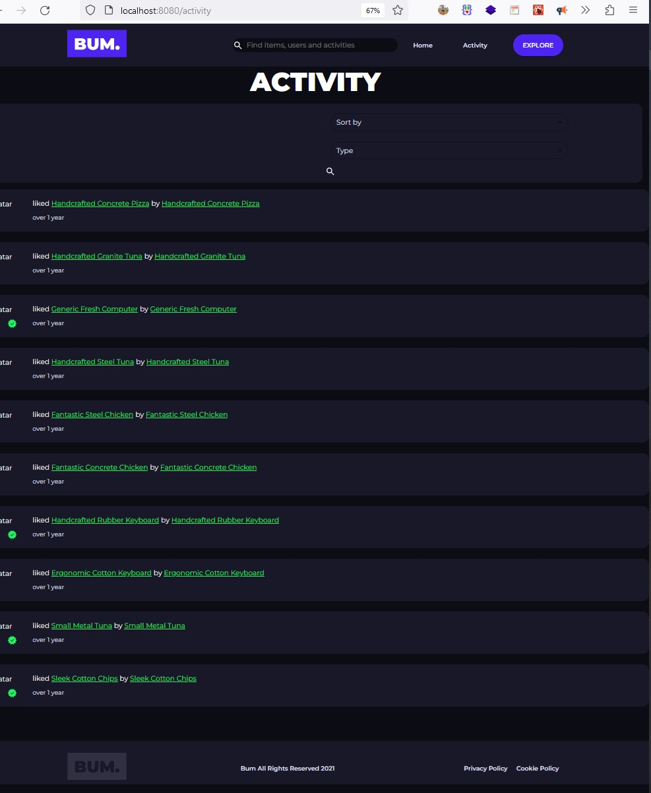
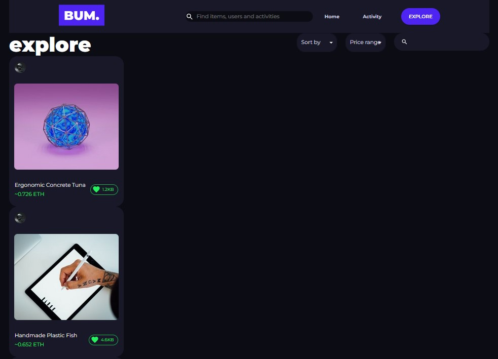
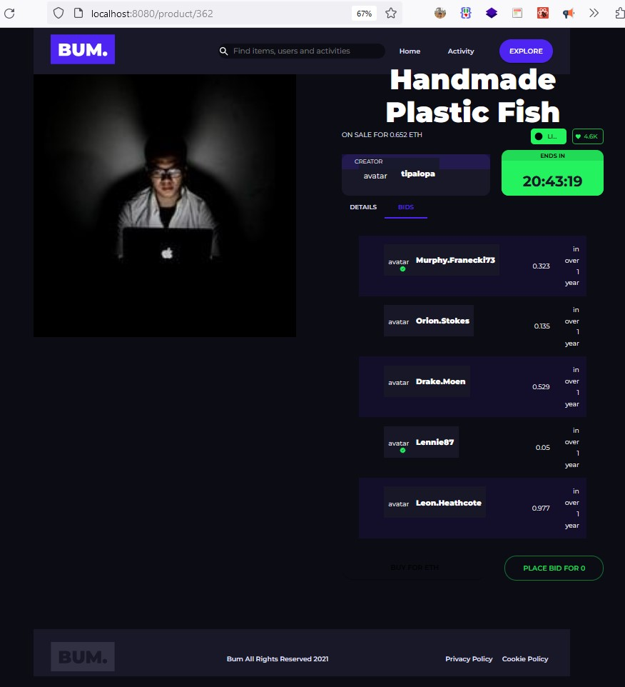

## Used technologies
- Next.js, SCSS, HTML, JS, @mui, millify, react-countdown
- Different Next.js modules
1. Next.js router
2. Hooks- useEffect, useState, useParams

- [ x ] able to personalize your account preferences
- [ x ] preferences must be saved in localStorage
- [ x ] sending requests to server by selecting filters
- [ x ] displaying data from server - profiles and bids associated with NFT
- [ x ] numbers and classes
- [ x ] trending page
- [ x ] product page
- [ x ] colector page
- [ x ] activity page
- [ x ] explore page

###
## Thank you!

## 🤔 How to use

```sh
npm i
npm run dev
```


## 😏 Some tips

- Use the colors from the `src/styles/colors.scss` file
- Use the custom `Link` component provided in the example
- Define pages in separate folders
- Use the classNames module when adding multiple (or single) classes
- Define components in the `/components` folder
- You shouldn't delete files from the boilerplate. You can only delete the Example component or build on top of it.

## 💡 The idea

The project uses [Next.js](https://github.com/zeit/next.js), which is a framework for server-rendered React apps.
It includes `@mui/material` and its peer dependencies, including `emotion`, the default style engine in MUI v5.
If you prefer, you can [use styled-components instead](https://mui.com/guides/interoperability/#styled-components).

## The link component

Next.js has [a custom Link component](https://nextjs.org/docs/api-reference/next/link).
The example folder provides adapters for usage with MUI.
More information [in the documentation](https://mui.com/guides/routing/#next-js).

## What's next?

<!-- #default-branch-switch -->

You now have a working example project.
You can head back to the documentation, continuing browsing it from the [templates](https://mui.com/getting-started/templates/) section.
